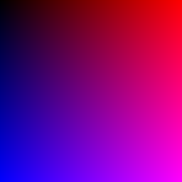
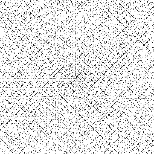
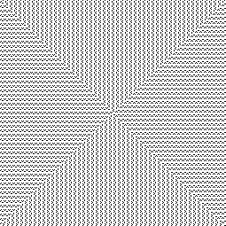
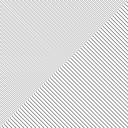
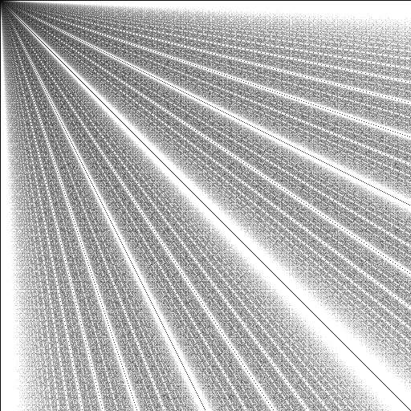
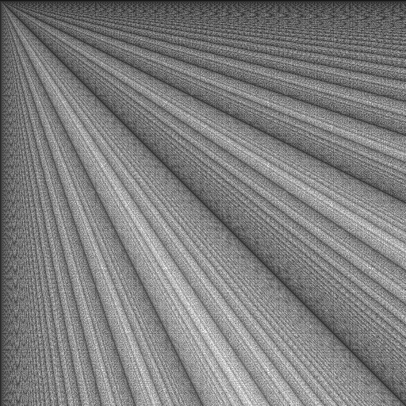
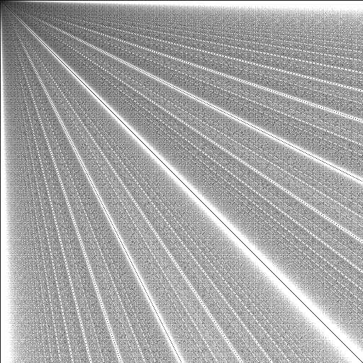

# Class 1

## Number Puzzles

[code](code/number_puzzles.py)

---

## Drawing using bitmap graphics

[code](code/bmp_lib_test.py)

---

## Drawings using vector graphics

[code](code/star_and_rectangle.py)

---

## Ulam Spiral

[Wikipedia link](https://en.wikipedia.org/wiki/Ulam_spiral)

[code](code/ulam_spiral.py)

### Primes

### Div by 4, 5 and 8

---

## GCD Visualization

[code](code/gcd_visualization.py)

### Euclid Algorithm

#### Sub Variant

#### Effective Mod Variant

#### Sub & Mod Mix

