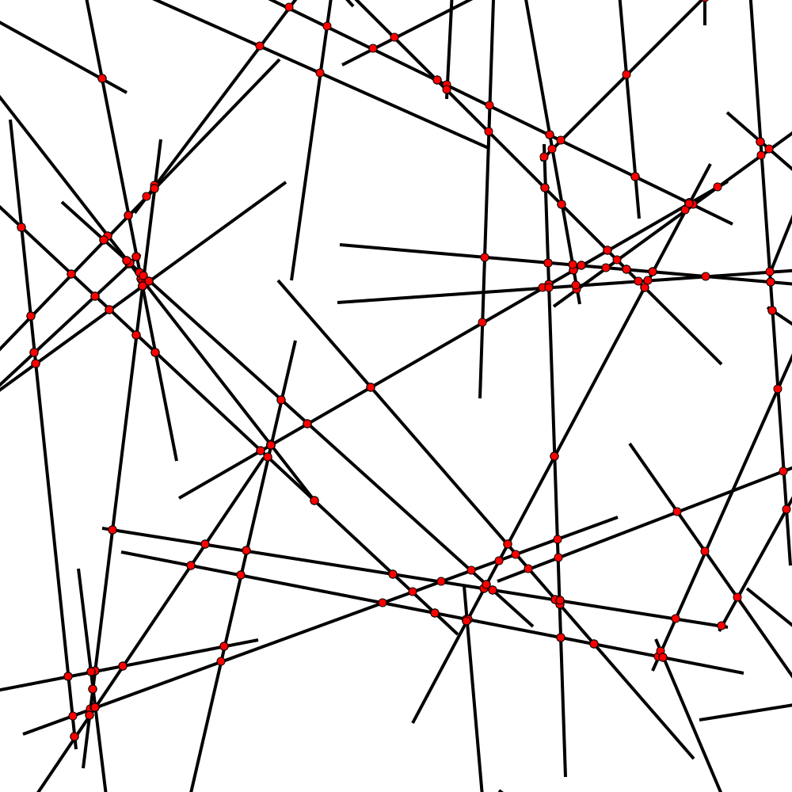
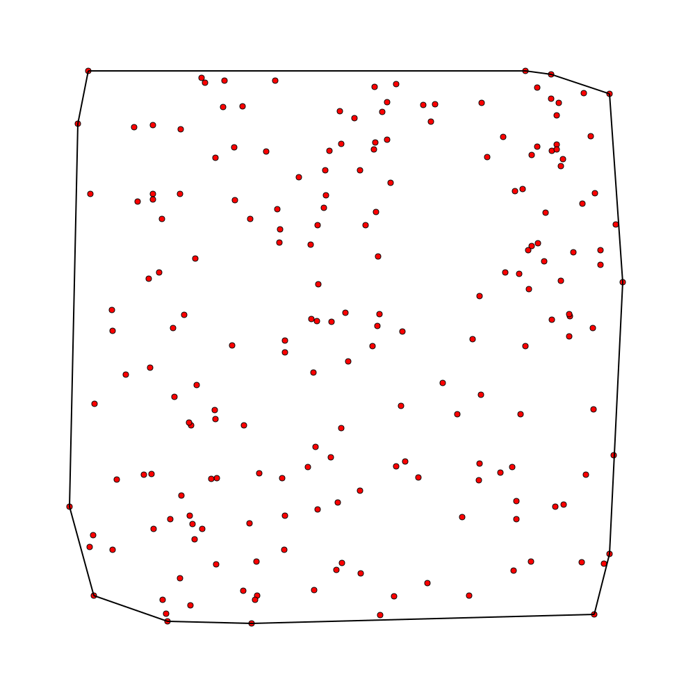
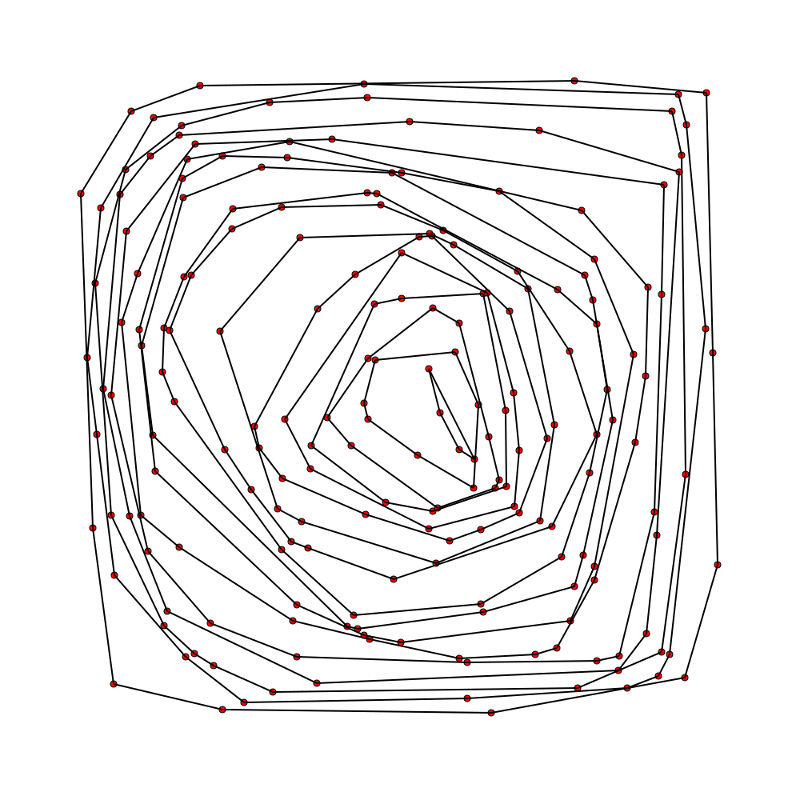

# Class 5

---

## Random Lines Intersections

[code](code/line_intersactions.py)

[animation](code/img/line_intersections_animate.svg)

---

## Triangulation

TODO

---

## Convex Hull

[code](code/convex_hull.py)

[animation](code/img/convex_hull_animate.svg)

---

[code](code/convex_hull.py)

[animation](code/img/convex_hull_concentric_animate.svg)

