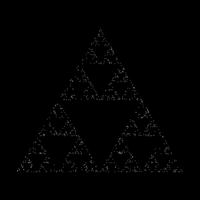
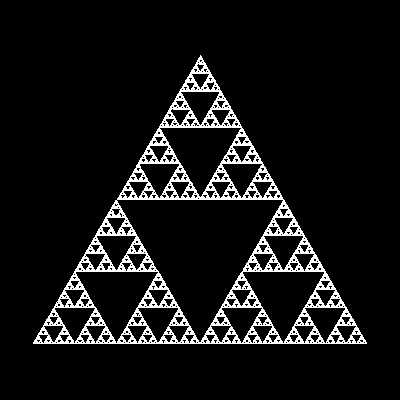

# Class 6

---

---

# Chaos Game

## Sierpinksi Triangle

[code](code/chaos_game.py)

Sierpinsky triangle after `1000`,`10000`,`100000` and `1000000` iterations with `r=0.5`.






<!---
Sierpinsky triangle after `1000000` iterations with `r=[0.1 .. 0.9]`.


-->

---

---

# Feigenbaum Diagram

[code](code/feigenbaum_diagram.py)

- Using logistic equation:
```
x1 = r * x0 * (1 - x0),  x0 in [0, 1], r in [0, 4]
```

- Specific areas of the diagram (`r` is on x-axis, `x` is on y-axis):
 - Calling function `feigenbaum_diagram(r1=0, r2=4, x1=0, x2=1)` will get us portion of the diagram with `r=[0, 4]` and `x=[0, 1]`.

```
r = [0, 4]
x = [0, 1]
```


```
r = [2, 4]
x = [0.5, 1]
```


```
r = [3, 4]
x = [0.75, 1]
```


```
r = [3.5, 4]
x = [0.875, 1]
```


---

---

# L-Systems


## Koch Snowflake
[code](code/lsystems.py)

[animation](code/img/koch_snowflake_animate.svg)

```
axiom = "F--F--F"
rules = {"F": "F+F--F+F"}
interpretation = {"F": ("forward", 1), "+": ("right", 60), "-": ("left", 60)}
depth = 6
```


## Sierpinski Triangle
[code](code/lsystems.py)

[animation](code/img/sierpinski_triangle_animate.svg)

```
axiom = "B"
rules = {"A": "B+A+B", "B": "A-B-A"}
interpretation = {"A": ("forward", 4), "B": ("forward", 4), "+": ("right", 60), "-": ("left", 60)}
depth = 8
```


## Hilbert Curve
[code](code/lsystems.py)

[animation](code/img/hilbert_curve_animate.svg)

```
axiom = "-L"
rules = {"L": "LF+RFR+FL-F-LFLFL-FRFR+", "R": "-LFLF+RFRFR+F+RF-LFL-FR"}
length = 10
interpretation = {"F": ("forward", length), "+": ("right", 90), "-": ("left", 90)}
depth = 4
```


## Trees

### Basic Tree
[code](code/lsystems.py)

[animation](code/img/basic_tree_animate.svg)

```
axiom = "A"
rules = {"A": "F[+A]-A", "F": "FF"}
length = 1
angle = 30
interpretation = {"F": ("forward", length), "[": ("stack", "push"), "]": ("stack", "pop"), "+": ("right", angle), "-": ("left", angle)}
depth = 9
```


### Fancy Tree 1
[code](code/lsystems.py)

[animation](code/img/fancy_tree_1_animate.svg)

```
axiom = "F"
rules = {"F": "F[+F]F[-F]F"}
length = 3
angle = 25.7
interpretation = {"F": ("forward", length), "[": ("stack", "push"), "]": ("stack", "pop"), "+": ("right", angle), "-": ("left", angle)}
depth = 5
```


### Fancy Tree 2
[code](code/lsystems.py)

[animation](code/img/fancy_tree_2_animate.svg)

```
axiom = "F"
rules = {"F": "F[+FF]F[-FF]F"}
length = 3
angle = 25.7
interpretation = {"F": ("forward", length), "[": ("stack", "push"), "]": ("stack", "pop"), "+": ("right", angle), "-": ("left", angle)}
depth = 5
```


### Stochastic Tree
[code](code/lsystems.py)

```
axiom = "F"
rules = {"F": ["[+F]F[−F]", "F[+F]F", "F[-F]F"]}
length = 5
angle = [25, 30, 35]
interpretation = {"F": ("forward", length), "[": ("stack", "push"), "]": ("stack", "pop"), "+": ("right", angle), "-": ("left", angle)}
depth = 9
```


