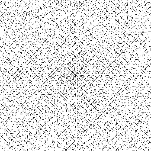
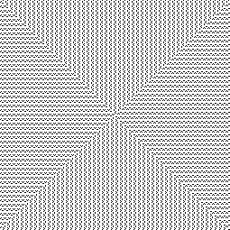
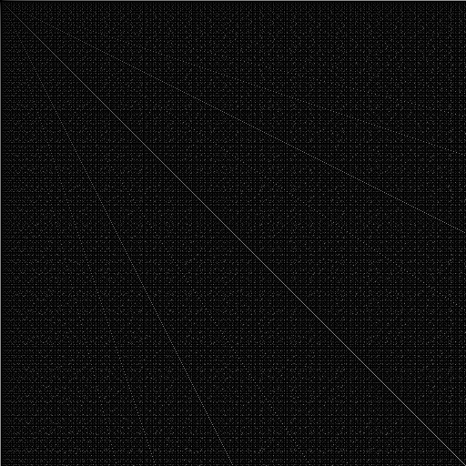
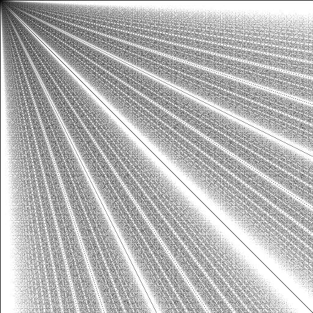
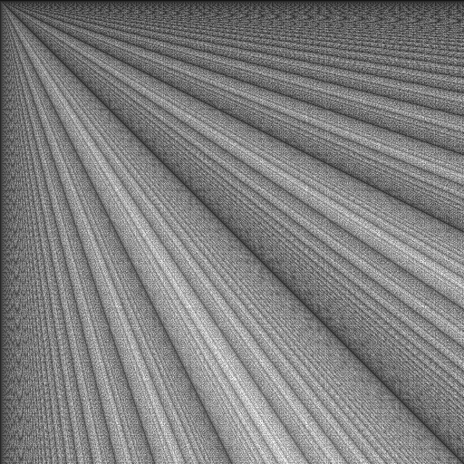
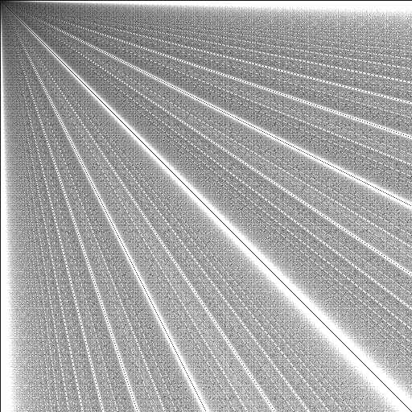

# Class 1

---

## Drawings using vector graphics

---

## Ulam Spiral

### Primes

### Div by 4, 5 and 8

---

## GCD Visualization

### Euclid Algorithm

#### Sub Variant

#### Effective Mod Variant

#### Sub & Mod Mix

