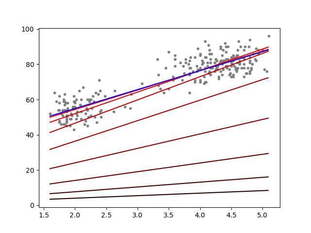

# Class 10

---

## Linear Regression & Gradient Descent

[code](code/linear_regression.py)

[Linear Regression](https://en.wikipedia.org/wiki/Linear_regression)

[Gradient Descent](https://en.wikipedia.org/wiki/Gradient_descent)


---

dataset: [faithful](code/data/faithful.txt)

```
Blue line is a=10.729641, b=33.474397, computed by the formula.
```

The more closer to red the lines is, the more iteration it took to compute it.

| iterations | a | b |
|------------|---|---|
| 2 | 1.433064 |  1.122668 |
| 8 | 4.948447 | 4.178314 |
| 16 | 8.209056 | 7.644576 |
| 32 | 11.650673 | 13.058335 |
| 64 | 13.193304 | 20.207599 |
| 128 | 12.222065 | 27.556718 |
| 256 | 11.046182 | 32.260256 |



---

dataset: [linreg](code/data/linreg.txt)

```
Blue line is a=2.399743, b=1.445519, computed by the formula.
```

The more closer to red the lines is, the more iteration it took to compute it.

| iterations | a | b |
|------------|---|---|
| 2 | 0.355727 | 0.148163 |
| 4 | 0.658922 | 0.280810 |
| 8 | 1.137532 | 0.506049 |
| 16 | 1.737311 | 0.832512 |
| 32 | 2.218969 | 1.182095 |
| 64 | 2.387213 | 1.395708 |
| 128 | 2.399759 | 1.443668 |
| 256 | 2.399743 | 1.445517 |


---

## Clusters Detection


