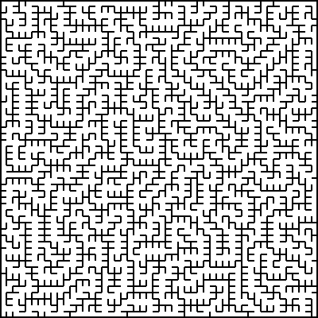
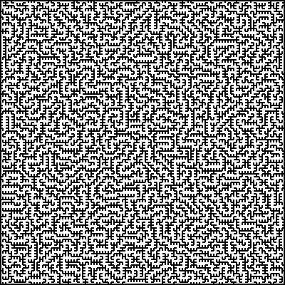
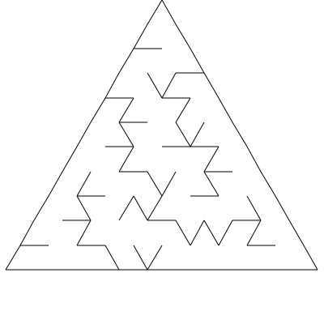
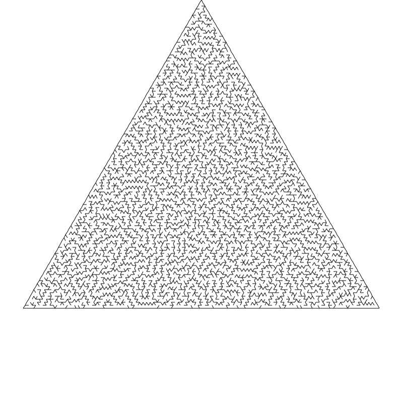

# Class 12

---

## Perfect, rectangular maze generation

[code](code/maze.py)

```
1. Create graph, where nodes represent rooms and edges walls.
2. Run DFS from starting position. Visit non-discovered neighbours randomly.
3. Remove wall between current node and neighbour.
4. Add neighbour to the visited nodes.
5. Add neighbour on top of the stack.
6. Repeat while there are unvisited nodes left.
```

[animation](code/img/rectangular_perfect_animated.svg)

Maze of size `10x10`.


Mazes of size `50x50` and `100x100`.

 

---

## Perfect, non-rectangular maze generation

[code](code/maze_pyramid.py)

```
Algorithm for generation is the same as for the rectangular maze.
When creating graph, we don't use rectangular grid, but triangles that form pyramid.
```

[animation](code/img/maze_pyramid_animate_10.svg)

Pyramid with depth level `10`.



[animation](code/img/maze_pyramid_animate_100.svg)

Pyramid with depth level `100`.


