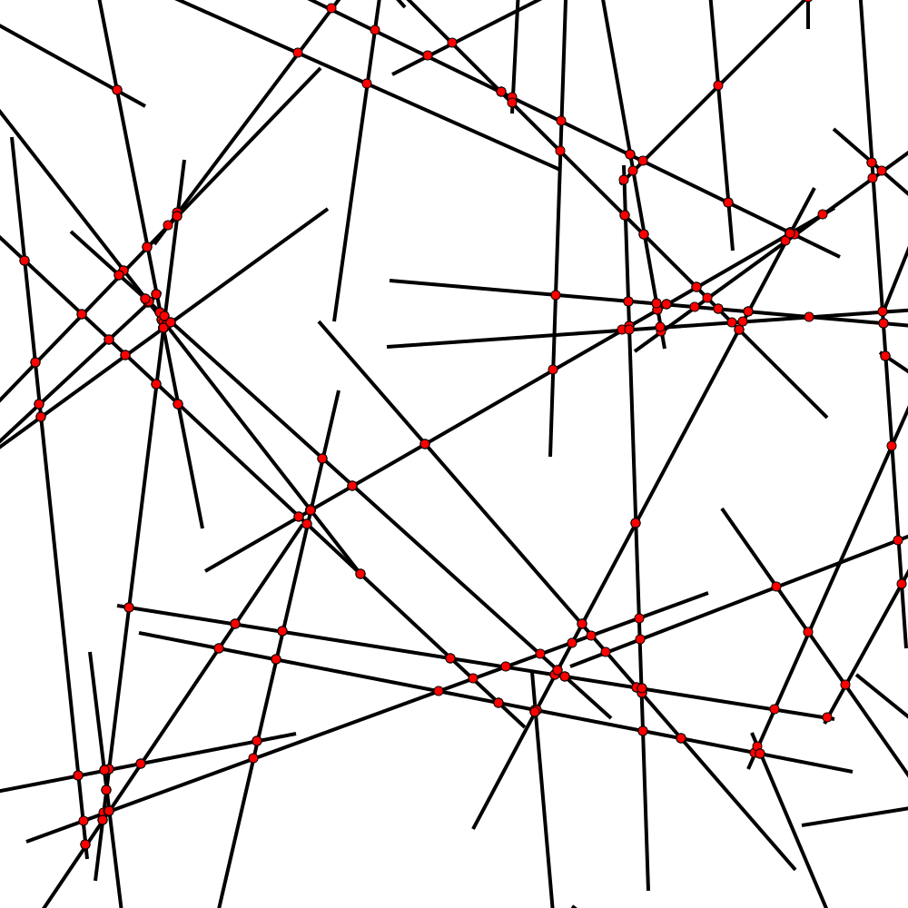

# Class 5

---

## Random Lines Intersections

[code](https://github.com/examon/iv122_math_code/blob/d53165d3c777784b1f24363bd0378e3dc81fee2c/class_5/code/line_intersactions.py#L87)

[animation](https://github.com/examon/iv122_math_code/blob/master/class_5/code/img/line_intersections_animate.svg)

---

## Triangulation

TODO

---

## Convex Hull

TODO
