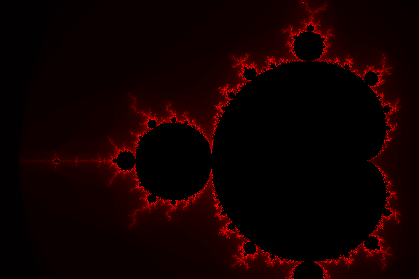

# Class 7

---

## Mandelbrot Set

Color is picet based on the number of iterations for `z` to get bigger than `2`.

Mandelbrot set `z = z*z + c` with zoom targeting point `c = tx + ty*i`, where
```
tx = -0.743643887037158704752191506114774
ty = 0.131825904205311970493132056385139
```



---

## Julia Set

Color is picet based on the number of iterations for `z` to get bigger than `2`.

Julia set `z = z*z + c` with changing `c`.</br>
`c = 0.7885*e^(ia)`, where `a` is from `[0, 3*pi]`.


Julia set `z = z*z + c` with changing `c` (animation is also reversed and added to the original).</br>
`c = -0.8 + a`, where `a` is from `[-0.5, 0.5]`.


---

## Newton Fractal

TODO
