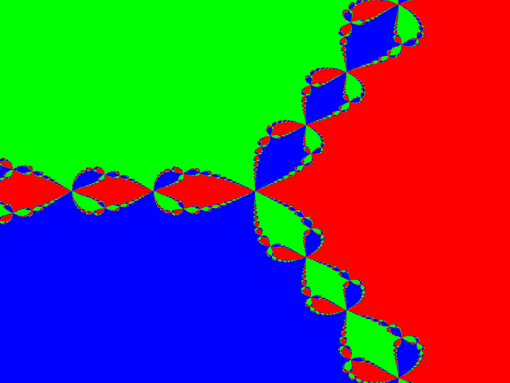

# Class 7

---

## Mandelbrot Set

[code](https://github.com/examon/iv122_math_code/blob/master/class_7/code/mandelbrot.py)

Color is picked based on the number of iterations for `z` to get bigger than `2`.

Mandelbrot set `z = z*z + c` with zoom targeting point `c = tx + ty*i`, where
```
tx = -0.743643887037158704752191506114774
ty = 0.131825904205311970493132056385139
```


Mandelbrot set `z = z*z + c` with zoom targeting point `c = tx + ty*i`, where
```
tx = -1.77810334274064037110522326038852639499207961414628307584575173232969154440
ty = 0.00767394242121339392672671947893471774958985018535019684946671264012302378
```


---

## Julia Set

[code](https://github.com/examon/iv122_math_code/blob/master/class_7/code/julia.py)

Color is picked based on the number of iterations for `z` to get bigger than `2`.

Julia set `z = z*z + c` with changing `c`.</br>
`c = 0.7885*e^(ia)`, where `a` is from `[0, 3*pi]`.


Julia set `z = z*z + c` with changing `c` (animation is also reversed and added to the original).</br>
`c = -0.8 + a`, where `a` is from `[-0.5, 0.5]`.


---

## Newton Fractal

[code](https://github.com/examon/iv122_math_code/blob/master/class_7/code/newton.py)

Color is picked based on the distance to the roots.

Newton fractal on the `f(z) = z^3 - 1`.


