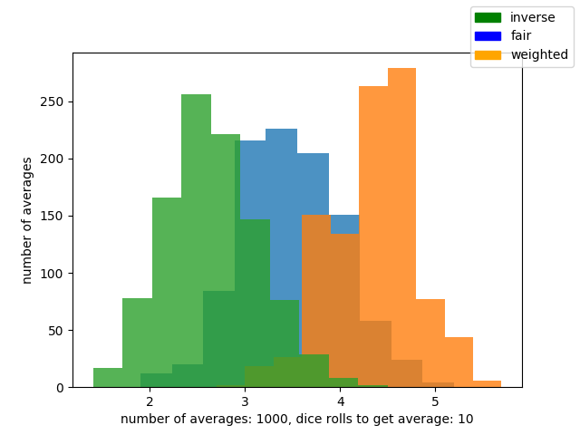
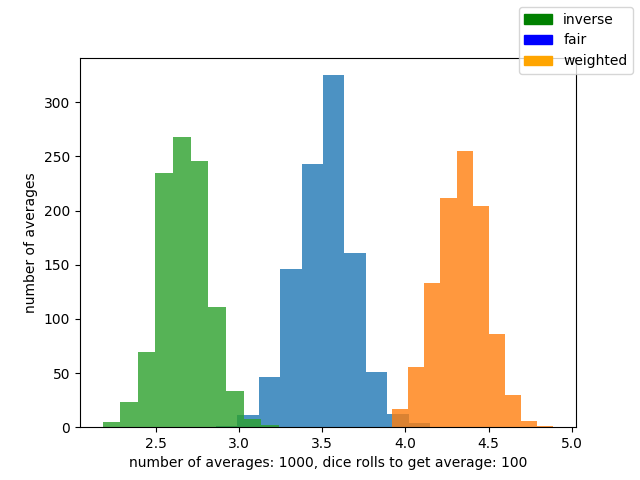
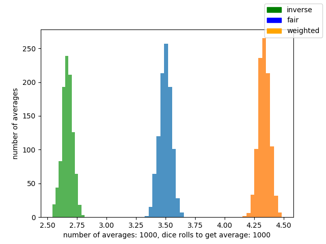
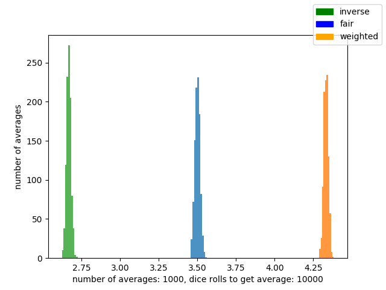
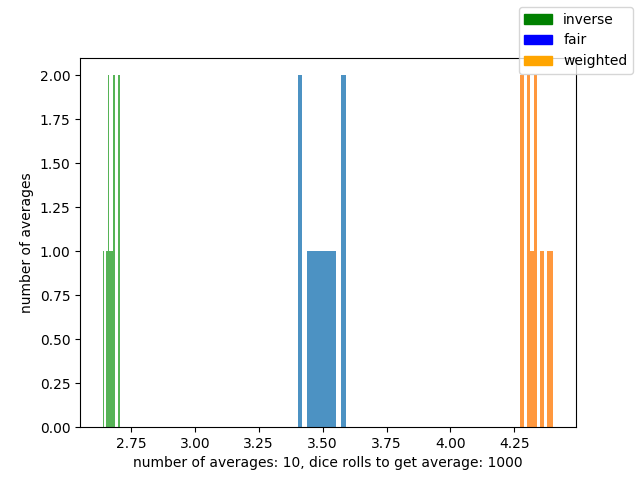
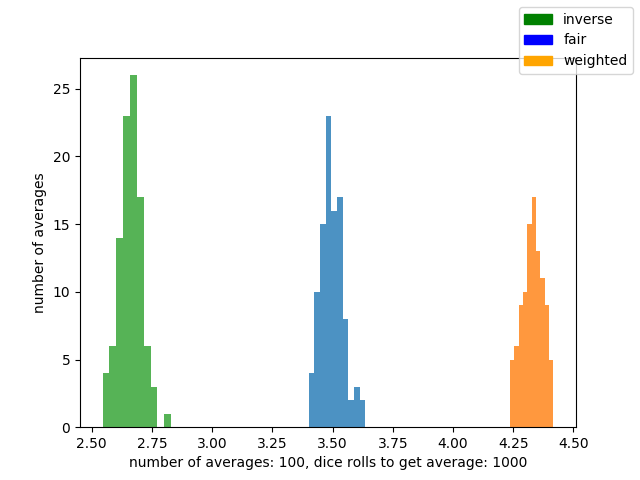
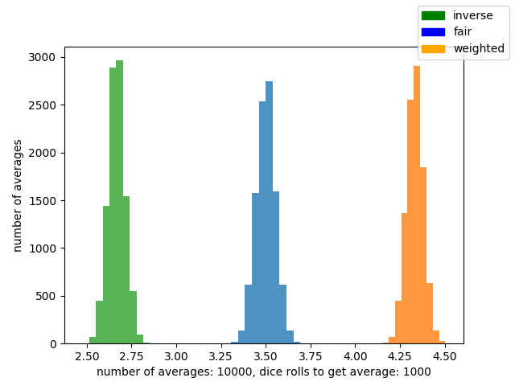

# Class 9

---

## Monty Hall Simulations

[Monty Hall problem](https://en.wikipedia.org/wiki/Monty_Hall_problem)

Suppose you're on a game show, and you're given the choice of three doors:<br>
Behind one door is a car; behind the others, goats.<br>

You pick a door, say No. 1, and the host, who knows what's behind the doors,
opens another door, say No. 3, which has a goat. He then says to you,<br>
"Do you want to pick door No. 2?" Is it to your advantage to switch your choice?<br>


#### We will simulate tree scenarios:


- player will not change his pick
 - `strategy: not_changing_pick, win chance: 0.341`
- player will change his pick after host shows him door with goat
 - `strategy: changing_pick, win chance: 0.676`
- player acts randomly, sometimes changing pick and sometimes not (with probability 0.5)
 - `strategy: random_change_pick, win chance: 0.492`

Simulation is using `1000` iterations.<br>
[code](code/monty_hall.py)

---

## Testing Randomness

[code with testing methods](code/random_numbers.py)

### random1.txt
- [data](code/data/random1.txt)

Looks non-random.<br>
Consecutive numbers dramatically vary in distribution.

```
data/random1.txt

number frequency:
{'1': 833, '2': 834, '3': 833, '4': 834, '5': 833, '6': 833}

bigram frequency:
{'25': 145, '56': 143, '64': 164, '22': 21, '62': 165, '66': 28,
 '41': 178, '14': 167, '35': 171, '54': 165, '12': 152, '36': 181,
 '44': 15, '55': 17, '43': 156, '61': 159, '34': 136, '11': 23,
 '16': 169, '52': 175, '51': 160, '21': 149, '32': 164, '23': 173,
 '46': 152, '15': 166, '45': 175, '65': 159, '31': 164, '13': 156,
 '63': 158, '33': 17, '24': 186, '42': 157, '26': 160, '53': 173}

consecutive number frequency:
{'1': {'1': 23, '2': 152, '3': 156, '4': 167, '5': 166, '6': 169},
 '2': {'1': 149, '2': 21, '3': 173, '4': 186, '5': 145, '6': 160},
 '3': {'1': 164, '2': 164, '3': 17, '4': 136, '5': 171, '6': 181},
 '4': {'1': 178, '2': 157, '3': 156, '4': 15, '5': 175, '6': 152},
 '5': {'1': 160, '2': 175, '3': 173, '4': 165, '5': 17, '6': 143},
 '6': {'1': 159, '2': 165, '3': 158, '4': 164, '5': 159, '6': 28}}
```

### random2.txt
- [data](code/data/random2.txt)

Probably non-random.<br>
Number frequency distribution is too big. Too little of 2 and too much of 5.

```
data/random2.txt

number frequency:
{'1': 856, '2': 428, '3': 829, '4': 845, '5': 1244, '6': 798}

bigram frequency:
{'25': 115, '56': 188, '64': 135, '22': 39, '62': 72, '66': 131,
 '41': 156, '14': 141, '35': 201, '54': 200, '12': 56, '36': 135,
 '44': 163, '33': 144, '34': 133, '43': 127, '61': 123, '55': 309,
 '11': 149, '16': 145, '52': 109, '51': 216, '21': 63, '32': 67,
 '23': 72, '46': 132, '15': 233, '45': 182, '65': 204, '31': 149,
 '13': 131, '63': 133, '24': 73, '42': 85, '26': 66, '53': 222}

consecutive number frequency:
{'1': {'1': 149, '2': 56, '3': 131, '4': 141, '5': 233, '6': 145},
 '2': {'1': 63, '2': 39, '3': 72, '4': 73, '5': 115, '6': 66},
 '3': {'1': 149, '2': 67, '3': 144, '4': 133, '5': 201, '6': 135},
 '4': {'1': 156, '2': 85, '3': 127, '4': 163, '5': 182, '6': 132},
 '5': {'1': 216, '2': 109, '3': 222, '4': 200, '5': 309, '6': 188},
 '6': {'1': 123, '2': 72, '3': 133, '4': 135, '5': 204, '6': 131}}
```

### random3.txt
- [data](code/data/random3.txt)

Looks random.<br>
Number frequency is around 820. Bigrams are evenly distributed as well as
consecutive numbers.
```
data/random3.txt

number frequency:
{'1': 819, '2': 836, '3': 850, '4': 824, '5': 821, '6': 850}

bigram frequency:
{'25': 134, '51': 134, '22': 138, '62': 122, '41': 135, '64': 149,
 '14': 135, '35': 123, '54': 124, '12': 161, '63': 158, '42': 128,
 '36': 156, '33': 141, '34': 140, '43': 139, '61': 124, '55': 146,
 '11': 136, '16': 134, '52': 143, '24': 141, '21': 144, '56': 141,
 '23': 149, '46': 140, '15': 123, '44': 135, '65': 149, '31': 146,
 '13': 130, '32': 144, '66': 148, '45': 146, '26': 130, '53': 133}

consecutive number frequency:
{'1': {'1': 136, '2': 161, '3': 130, '4': 135, '5': 123, '6': 134},
 '2': {'1': 144, '2': 138, '3': 149, '4': 141, '5': 134, '6': 130},
 '3': {'1': 146, '2': 144, '3': 141, '4': 140, '5': 123, '6': 156},
 '4': {'1': 135, '2': 128, '3': 139, '4': 135, '5': 146, '6': 140},
 '5': {'1': 134, '2': 143, '3': 133, '4': 124, '5': 146, '6': 141},
 '6': {'1': 124, '2': 122, '3': 158, '4': 149, '5': 149, '6': 148}}
```

### random4.txt
- [data](code/data/random4.txt)

Probably non-random.<br>
There are not enough bigrams. Looks like arranged sequence.

```
data/random4.txt

number frequency:
{'1': 852, '2': 827, '3': 829, '4': 850, '5': 819, '6': 823}

bigram frequency:
{'25': 286, '52': 271, '14': 271, '16': 290, '21': 276, '32': 265,
 '41': 279, '23': 265, '54': 277, '12': 291, '45': 281, '65': 252,
 '56': 271, '43': 290, '61': 297, '34': 301, '36': 262, '63': 274}

consecutive number frequency:
{'1': {'2': 291, '4': 271, '6': 290},
 '2': {'1': 276, '3': 265, '5': 286},
 '3': {'2': 265, '4': 301, '6': 262},
 '4': {'1': 279, '3': 290, '5': 281},
 '5': {'2': 271, '4': 277, '6': 271},
 '6': {'1': 297, '3': 274, '5': 252}}
```

### random5.txt
- [data](code/data/random5.txt)

Probably non-random.<br>
Consecutive number frequency has a pattern (three levels of frequencies
~40, ~100, ~500). Same with bigrams.

```
data/random5.txt

number frequency:
{'1': 808, '2': 836, '3': 812, '4': 843, '5': 842, '6': 859}

bigram frequency:
{'32': 43, '25': 299, '56': 39, '64': 41, '22': 102, '62': 557,
 '66': 59, '41': 560, '14': 40, '35': 102, '54': 49, '12': 41,
 '44': 43, '55': 115, '34': 551, '43': 45, '61': 33, '51': 44,
 '11': 35, '16': 553, '52': 44, '24': 118, '21': 108, '63': 51,
 '23': 93, '46': 40, '15': 102, '36': 52, '65': 118, '31': 28,
 '13': 36, '45': 106, '33': 36, '42': 49, '26': 116, '53': 551}

consecutive number frequency:
{'1': {'1': 35, '2': 41, '3': 36, '4': 40, '5': 102, '6': 553},
 '2': {'1': 108, '2': 102, '3': 93, '4': 118, '5': 299, '6': 116},
 '3': {'1': 28, '2': 43, '3': 36, '4': 551, '5': 102, '6': 52},
 '4': {'1': 560, '2': 49, '3': 45, '4': 43, '5': 106, '6': 40},
 '5': {'1': 44, '2': 44, '3': 551, '4': 49, '5': 115, '6': 39},
 '6': {'1': 33, '2': 557, '3': 51, '4': 41, '5': 118, '6': 59}}
```

### random6.txt
- [data](code/data/random6.txt)

Probably non-random.<br>
Consecutive number frequency has a pattern (three levels of frequencies
~90, ~140, ~190). Same with bigrams.

```
data/random6.txt

number frequency:
{'1': 849, '2': 851, '3': 849, '4': 846, '5': 803, '6': 802}

bigram frequency:
{'32': 141, '25': 142, '22': 142, '16': 142, '66': 141, '64': 141,
 '14': 188, '35': 95, '54': 141, '12': 142, '42': 141, '44': 94,
 '33': 189, '34': 141, '43': 141, '61': 141, '55': 95, '45': 188,
 '62': 96, '52': 189, '51': 142, '21': 189, '63': 142, '23': 141,
 '46': 141, '15': 141, '36': 141, '65': 141, '31': 142, '11': 94,
 '13': 142, '56': 142, '24': 141, '41': 141, '26': 95, '53': 94}

consecutive number frequency:
{'1': {'1': 94, '2': 142, '3': 142, '4': 188, '5': 141, '6': 142},
 '2': {'1': 189, '2': 142, '3': 141, '4': 141, '5': 142, '6': 95},
 '3': {'1': 142, '2': 141, '3': 189, '4': 141, '5': 95, '6': 141},
 '4': {'1': 141, '2': 141, '3': 141, '4': 94, '5': 188, '6': 141},
 '5': {'1': 142, '2': 189, '3': 94, '4': 141, '5': 95, '6': 142},
 '6': {'1': 141, '2': 96, '3': 142, '4': 141, '5': 141, '6': 141}}
```

### random7.txt
- [data](code/data/random7.txt)

Looks pretty random.

```
data/random7.txt

number frequency:
{'1': 838, '2': 842, '3': 823, '4': 834, '5': 833, '6': 830}

bigram frequency:
{'25': 141, '64': 139, '22': 148, '62': 135, '66': 141, '41': 137,
 '14': 138, '35': 136, '54': 135, '12': 142, '63': 136, '42': 140,
 '44': 142, '33': 140, '34': 138, '43': 136, '61': 141, '51': 142,
 '11': 143, '16': 140, '52': 141, '55': 140, '21': 136, '56': 135,
 '23': 135, '46': 139, '15': 138, '45': 140, '65': 138, '31': 139,
 '13': 137, '32': 135, '24': 142, '36': 135, '26': 140, '53': 139}

consecutive number frequency:
{'1': {'1': 143, '2': 142, '3': 137, '4': 138, '5': 138, '6': 140},
 '2': {'1': 136, '2': 148, '3': 135, '4': 142, '5': 141, '6': 140},
 '3': {'1': 139, '2': 135, '3': 140, '4': 138, '5': 136, '6': 135},
 '4': {'1': 137, '2': 140, '3': 136, '4': 142, '5': 140, '6': 139},
 '5': {'1': 142, '2': 141, '3': 139, '4': 135, '5': 140, '6': 135},
 '6': {'1': 141, '2': 135, '3': 136, '4': 139, '5': 138, '6': 141}}
```

---

## Central Limit Theorem

``` a
fair = fair dice
weighted = weighted dice, proportional to the number on the side
inverse = weighted dice, inversely proportional to the number on the side

- When using the fair dice, the more rolls we do to compute average,
  the closer the average will be to 3.5=(1+2+3+4+5+6)/6.
- When using weighted dice, the average should be 4.33=(6*6+5*5+4*4+3*3+2*2+1*1)/(6+5+4+3+2+1)
- When using inverse dice, the average should be 2.66=(6*1+5*2+4*3+3*4+2*5+1*6)/(6+5+4+3+2+1)
```

```
We are going to run first set of 4 experiments.
In each of them, we are going to roll the dice 10, 100, 1000, 10000 times,
compute the average and repeat this 1000 times.

The more rolls we do in order to compute the average, the more precise the average will get.
```







```
In the second set of experiments, We are rolling the dice always 1000 times to
compute the average.
But this time, we are going to repeat this experiment 10, 100, 1000, 10000 times.

The more iterations of the experiment we do, the more defined normal distribution we should see.
```







---

## Bayes Theorem and Simulations

`TODO`
